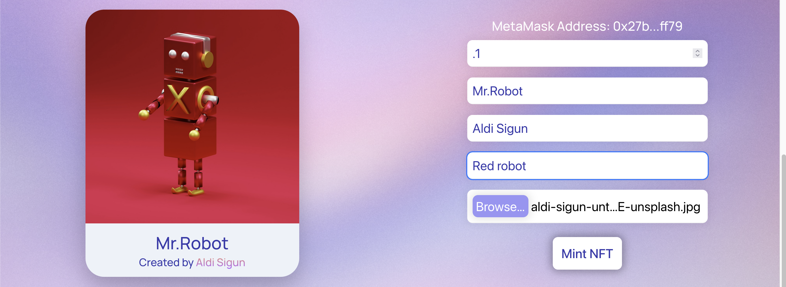

# NFT Minter

## About this project

This project is a proof of concept of an NFT Minting service. A smart contract following the [ERC721](https://eips.ethereum.org/EIPS/eip-721) standard was deployed on the Ropsten testnet. NFT's are minted on demmand by users using the functionality of the contract. A web client was created to allow users to mint NFT's and view the currently minted NFT's of the contract in the gallery.

I started this project durring the spring quarter of my senior year in 2022. Initially I created this project to get more experience building web applications and learn more about how to integrate web applications with the Ethereum blockchain. Durring this time I was also taking CSCD 467 (Parallel and Cloud Computing) at Eastern Washington University. I decided to improve on this project by using it as my final project for this class and migrating the server functionality to the cloud using AWS services.

## How this project works

### The Client

The client is a web application that allows users to mint NFT's and view the currently minted NFT's of the contract in the gallery. This is possible by using the [ethers.js](https://docs.ethers.io/v5/) library to interact with the ethereum blockchain. [MetaMask](https://metamask.io) is used to sign transactions and connect to the users crypto wallet. The user simply has to connect their wallet if they wish to mint NFT's and fill out a form with the NFT information.

### The Cloud

AWS services where used for backend functionality. Specifically, the following services were used:

- [AWS API Gateway](https://aws.amazon.com/api-gateway/)
- [AWS Lambda](https://aws.amazon.com/lambda/)
- [AWS S3](https://aws.amazon.com/s3/)

Two of the functions are used to process the data for an NFT before it is minted. The data is pinned to an IPFS Node and the IPFS hash for the content is used as the URI for the NFT. This gives the user the ability to take control of the data pertaining to the NFT. For faster access from the client and to avoid using IPFS gateways, the data is stored in S3 as well.

One function is used to grab the existing URI's for the NFT's in the contract and display them in the gallery. Since the hashes are stored in the contract, the client can simply grab the hash and use it to get the data from S3. To communicate with the smart contract, [Alchemy](https://www.alchemy.com) was used to communicate with the smart contract in the function. 

## How to use this project

Make sure you have [Metamask](https://metamask.io) installed and connected to your wallet. Since this is a proof of concept, the contract is not deployed to the mainnet and is only deployed to the Ropsten testnet. You can enable the Ropsten testnet by going to `Settings > Advanced > Show Test Networks`. 

You will also need some ether to complete transactions which can be sent to your wallet using a [faucet](https://faucet.egorfine.com). Ether on the testnet is free as it holds no real monitary value.

Check out the project [here](https://cma-nft-minter.netlify.app/)